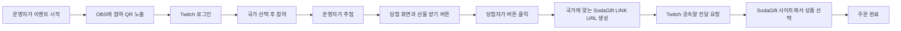

# StreamDrop

> 당첨의 순간을 전 세계 팬의 선물로 연결하는 Twitch 라이브 리워드 서비스

StreamDrop은 Twitch 방송의 QR 참여, 실시간 추첨, 당첨자 승인, 국가별 SodaGift LINK 수령을 하나의 흐름으로 연결한 해커톤 MVP입니다. 운영자는 OBS와 운영자 화면에서 이벤트를 진행하고, 참가자는 Twitch 계정으로 참여해 자신의 휴대폰에서 결과와 선물 수령 절차를 확인합니다.

- 발표 자료: [StreamDrop Twitch 해커톤 기획안 v3](Demo/Presentation/StreamDrop_Twitch_%ED%95%B4%EC%BB%A4%ED%86%A4_%EA%B8%B0%ED%9A%8D%EC%95%88_v3.pptx)
- 최종 데모: [raffle-app](raffle-app)
- 초기 OBS 프로토타입: [streamdrop-app](streamdrop-app)
- 공개 데모: [홈](https://hackathon-korean-team5.web.app) · [참여](https://hackathon-korean-team5.web.app/join) · [오버레이](https://hackathon-korean-team5.web.app/overlay) · [운영자](https://hackathon-korean-team5.web.app/admin?token=streamdrop)
- 현재 통합 브랜치: [feature/TEAM5-sodagift-LINK-test](https://github.com/Changjae-LE/socal-k-group-hackathon/tree/feature/TEAM5-sodagift-LINK-test)

## Team 5

| 멤버 | 소개 |
|---|---|
| Dexter Kim | 식사와 응원을 맡은 팀의 에너지 |
| Christian Lee | 개성 넘치는 멋쟁이 |
| 이창재 | 얼굴을 담당하고 있는 팀의 비주얼 |
| 최재원 | 5팀의 브레인 |

## 1. 아이디어 채택

### 채택 방법

하루 안에 실제 동작하는 결과를 만들기 위해 후보 아이디어를 다음 기준으로 비교했습니다.

1. **문제 크기:** 글로벌 팬이 실제로 겪는 지급 문제인가?
2. **구현 가능성:** 4명이 하루 안에 핵심 흐름을 시연할 수 있는가?
3. **API 적합성:** SodaGift LINK 방식의 강점을 분명하게 보여주는가?
4. **관심도:** 현장에서 누구나 참여하고 결과를 바로 이해할 수 있는가?
5. **수익 확장성:** 반복 캠페인과 경품 주문으로 이어질 수 있는가?

### 채택 배경

- 글로벌 팬은 같은 방송에 모이지만 사용할 수 있는 상품과 통화는 국가마다 다릅니다.
- 라이브 추첨의 흥분이 유지되는 동안 당첨자가 바로 보상을 확인해야 합니다.
- 실물 배송은 주소 수집, 배송비, 개인정보 처리 부담이 큽니다.
- SodaGift LINK는 이메일이나 배송 주소를 먼저 수집하지 않고 수령 경험으로 연결할 수 있습니다.

## 2. 제품 흐름



핵심 원칙은 **당첨자가 “선물 받기”를 눌러 승인한 뒤에만 수령 LINK를 생성한다**는 것입니다.

### 참가자

1. 방송 화면의 QR을 스캔합니다.
2. Twitch 계정으로 로그인합니다. 별도 닉네임 참여는 지원하지 않습니다.
3. 국가를 선택하고 이벤트에 참여합니다.
4. 당첨되면 결과와 **선물 받기** 버튼이 함께 표시됩니다.
5. 버튼을 누르면 국가에 맞는 SodaGift LINK URL이 생성됩니다.
6. Twitch 귓속말 또는 참가자 화면의 수령 경로로 URL을 엽니다.
7. SodaGift 사이트에서 원하는 상품을 선택하고 주문을 완료합니다.

### 운영자

1. `/admin`에서 이벤트를 시작합니다.
2. Twitch 참가자와 국가 선택 여부를 확인합니다.
3. 당첨 인원을 정하고 추첨합니다.
4. LINK 생성 상태, Twitch 접수 상태, 생성된 수령 URL을 확인합니다.
5. 이벤트를 초기화해 다음 시연을 준비합니다.

### 방송 화면

OBS Browser Source에 `/overlay`를 추가하면 QR, 참여 인원, 당첨자 발표가 Twitch 송출 화면에 실시간으로 반영됩니다.

## 3. 기능 정의

| 영역 | 구현 내용 |
|---|---|
| 참여 `/join` | Twitch OAuth, 국가 선택, 참여·추첨 결과, 선물 받기 버튼 |
| 방송 `/overlay` | QR, 참여 인원, 당첨자 발표 애니메이션 |
| 운영 `/admin` | 이벤트 시작, 참가자 확인, 추첨, 지급 상태와 URL 확인 |
| 실시간 상태 | Firebase Hosting + Firestore `events/live` 동기화 |
| 지급 브리지 | 당첨자 승인 감지, SodaGift LINK 발급, Twitch 귓속말 요청 |
| 보안 | API 키는 로컬 환경변수에만 저장하고 수령 URL은 공개 화면에서 분리 |
| 데모 폴백 | 참가자 직접 수령 버튼과 운영자 URL 확인 경로 유지 |

## 4. 시스템 아키텍처

```text
Twitch 방송 + OBS Browser Source
              │
              ▼
Firebase Hosting + Firestore
  ├─ /join        Twitch 로그인 · 국가 · 개인 결과
  ├─ /admin       이벤트 시작 · 추첨 · 지급 상태
  └─ /overlay     QR · 참여 인원 · 당첨 발표
              │ 당첨자 승인
              ▼
Local Gift Bridge
  ├─ SodaGift Sandbox API → 국가별 LINK URL
  └─ Twitch Helix API     → 귓속말 전달 요청
```

브라우저에는 SodaGift API 키를 넣지 않습니다. 공개 Firestore에는 상품 정보와 암호화된 링크만 저장하고, 평문 수령 URL의 복호화는 참가자 또는 운영자 브라우저에서만 진행합니다.

## 5. 데모 진행 순서

1. 로컬 지급 브리지를 실행합니다.
2. Twitch 방송과 OBS 오버레이를 보여줍니다.
3. 운영자가 **이벤트 시작**을 누르면 QR이 활성화됩니다.
4. 참가자는 QR을 스캔하고 Twitch 로그인 → 국가 선택 → 참여를 완료합니다.
5. 운영자가 **추첨하기**를 누르면 OBS와 참가자 화면에 결과가 표시됩니다.
6. 당첨자의 화면에는 결과와 **선물 받기** 버튼이 함께 나타납니다.
7. 당첨자가 버튼을 누르면 SodaGift LINK URL이 생성됩니다.
8. Twitch API가 해당 URL의 귓속말 전달을 요청합니다.
9. 당첨자는 SodaGift 사이트에서 상품을 선택한 뒤 주문을 완료합니다.

**완료 기준:** Twitch 로그인 → 국가 선택 → 추첨 → 당첨자 승인 → 실제 SodaGift URL 생성 → 수령 사이트 진입.

## 6. 챌린지: Twitch 귓속말

Twitch Send Whisper API는 요청을 정상 접수하면 HTTP `204 No Content`를 반환합니다. 하지만 Twitch가 스팸이나 정책 위반 가능성을 감지하면 같은 `204`를 반환하면서 메시지를 실제 수신함에 전달하지 않는 **silent drop**이 발생할 수 있습니다.

따라서 StreamDrop은 `전송됨` 대신 `Twitch 접수`로 상태를 표시하며, 귓속말을 보장 경로로 간주하지 않습니다.

### 데모 대응

- 참가자 화면의 **선물 받기/수령** 경로를 계속 유지합니다.
- 운영자 화면에서 생성된 SodaGift URL을 확인할 수 있습니다.
- 수신자는 발신 계정을 팔로우하거나 먼저 일반 귓속말을 보내 관계를 만듭니다.
- 발신 계정은 전화번호 인증과 `user:manage:whispers` 권한을 사용합니다.
- 귓속말은 보조 알림, 참가자 화면은 기본 수령 경로로 운영합니다.

참고: [Twitch Whisper API](https://dev.twitch.tv/docs/chat/whispers/) · [Twitch 귓속말 설정](https://help.twitch.tv/s/article/how-to-use-whispers)

## 7. 추가 기능: AI 선물 추천

별도 브랜치 [feat/ai-gift-recommendation](https://github.com/Changjae-LE/socal-k-group-hackathon/tree/feat/ai-gift-recommendation)에는 낙첨자를 다시 참여 고객으로 연결하는 추천 기능이 구현되어 있습니다.

```text
Twitch 팔로우 채널·콘텐츠 카테고리
                +
참가 국가별 SodaGift 상품 카탈로그
                ↓
Claude 기반 Top 3 선물 추천 + 추천 이유
                ↓
낙첨자 참가 화면에 맞춤 상품 표시
```

- 모델: `claude-haiku-4-5`
- 입력: 팔로우 채널, 콘텐츠 카테고리, 참가 국가, 국가별 상품 목록
- 출력: 카탈로그 내부 상품 Top 3와 짧은 추천 이유
- 안정성: AI 키가 없거나 호출·파싱에 실패하면 랜덤 3개 상품으로 폴백
- 기대 효과: 낙첨 경험을 종료하지 않고 SodaGift 상품 탐색과 후속 구매로 전환

## 8. StreamDrop의 비전과 SodaGift 시너지

StreamDrop은 단발성 경품 발송 도구가 아니라, 라이브 참여를 국가별 상품 선택과 반복 주문으로 연결하는 캠페인 플랫폼을 목표로 합니다.

### 현실적인 수익 구조

- 주최자 대상 캠페인 생성·운영 이용료
- 경품 주문 연계 수익 또는 SodaGift 제휴 마진
- 반복 행사 계약과 브랜드별 운영 패키지
- AI 추천을 활용한 낙첨자 후속 구매 전환

### 적용 분야

- **K-CON 및 K-pop 콘서트:** 현장·온라인 팬 퀴즈, 좌석 이벤트, 아티스트 라이브
- **게임 출시 방송:** 미션 달성, 베타키·기프트카드 보상
- **크리에이터 팬미팅:** 구독자 감사 추첨, 글로벌 팬 리워드
- **스포츠 라이브:** 득점 예측, 하프타임 퀴즈, 스폰서 경품
- **브랜드 라이브 커머스:** 시청 유지 이벤트, 구매 전환 쿠폰

### SodaGift에 기대되는 효과

- 라이브 이벤트마다 국가별 상품 주문이 반복적으로 발생
- 기존 크리에이터·브랜드가 새로운 B2B 캠페인 고객으로 유입
- 참여 → 수령 → 상품 선택 데이터를 활용한 카탈로그 최적화

핵심 지표는 참여→수령 전환율, 이벤트당 주문액, 평균 지급 시간, 반복 캠페인 비율입니다.

## 9. 실행과 설정

### Firebase 공개 데모

- Hosting 사이트: `hackathon-korean-team5`
- `BASE_URL`: `https://hackathon-korean-team5.web.app/`
- Twitch Redirect URL: `https://hackathon-korean-team5.web.app/join`
- 예비 Redirect URL: `https://hackathon-korean-team5.web.app/join/callback`

참가자는 반드시 Twitch OAuth로 로그인해야 합니다. OAuth 없는 로컬 참가자 또는 별도 닉네임 참여 경로는 제공하지 않습니다.

### 로컬 지급 브리지

```bash
cd raffle-app
python3.12 -m venv .venv
source .venv/bin/activate
pip install -r requirements.txt
cp .env.example .env

# 현재 처리 대상만 확인
python scripts/fulfill_firestore_winners.py --dry-run

# 당첨 감지 → 참가자 승인 후 LINK 발급과 전달 요청
python scripts/fulfill_firestore_winners.py
```

주요 환경변수:

| 이름 | 용도 |
|---|---|
| `BASE_URL` | 공개 서비스 기준 URL (`https://hackathon-korean-team5.web.app/`) |
| `TWITCH_CLIENT_ID` | Twitch OAuth 앱 ID |
| `TWITCH_CLIENT_SECRET` | Twitch OAuth 앱 Secret |
| `TWITCH_BOT_USER_ID` | 귓속말 발신 계정 ID |
| `TWITCH_BOT_TOKEN` | `user:manage:whispers` 사용자 토큰 |
| `SODAGIFT_API_KEY` | SodaGift Sandbox API 키 |
| `SODAGIFT_BASE_URL` | SodaGift Sandbox API 주소 |
| `ADMIN_TOKEN` | 운영자 화면 접근 토큰 |

실제 API 키, 토큰, 평문 수령 URL은 GitHub에 커밋하지 않습니다.

## 10. AI를 활용한 개발 과정

- **개발 도구:** OpenAI Codex
- **모델:** GPT-5 계열
- **제품 AI:** Claude Haiku 4.5 기반 선물 추천
- **활용 범위:** 아이디어 비교, 하루 범위 축소, UX·API 흐름 설계, 구현, 오류 진단, 테스트, 문서와 발표자료 작성

워크플로는 **사람이 목표와 제약 정의 → AI가 설계·코드 초안 → 실제 API와 화면 실행 → 팀이 판단·피드백 → AI 수정 → E2E 재검증**의 짧은 반복으로 운영했습니다.

AI가 특히 잘한 부분:

- 방대한 아이디어를 하루 안에 시연 가능한 핵심 경로로 축소
- Twitch·Firebase·SodaGift 사이의 상태와 실패 조건 정리
- Mock Mode, 직접 수령 URL 등 데모 폴백 설계
- 구현 상태와 README·PPT 메시지의 정합성 확인

사람이 반드시 담당한 부분:

- 실제 Twitch 계정 정책과 스팸 필터 확인
- SodaGift Sandbox 주문과 비용 검증
- OBS, 현장 네트워크, 실기기 리허설
- 생성 코드의 보안과 최종 제품 판단

## 11. 심사 기준 대응

| 기준 | StreamDrop의 대응 |
|---|---|
| 아이디어 50% | 글로벌 팬 지급 문제에 Twitch의 실시간성과 SodaGift LINK를 결합 |
| 완성품 30% | Twitch 로그인, 국가 선택, OBS 추첨, 당첨자 승인, 실제 수령 URL까지 동작 |
| PT 20% | 실제 데모, 귓속말 한계와 대응, AI 활용 과정, 수익 비전을 명확히 설명 |

## 12. 데모 이후의 다음 단계

- Firebase Authentication과 서버 전용 권한으로 공개 데모 규칙 강화
- 지속형 주문·재시도 큐와 지급 감사 로그
- Twitch EventSub 기반 전달 상태 보완과 다채널 알림
- 캠페인별 예산·국가·상품 가격대 설정
- AI 선물 추천 브랜치 통합과 추천 성과 측정
- 다국어, 접근성, 개인정보 처리 정책 보완

---

**StreamDrop × SodaGift — 글로벌 팬 리워드의 가장 짧은 경로**
