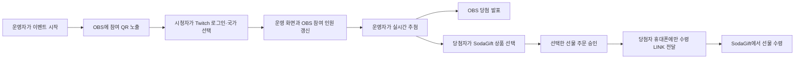

# StreamDrop

> Twitch 라이브 방송의 QR 참여부터 추첨, 국가별 디지털 선물 수령까지 한 흐름으로 연결하는 글로벌 팬 리워드 서비스

StreamDrop은 전 세계 시청자가 함께하는 Twitch 방송에서 이벤트 경품을 빠르고 안전하게 전달하기 위한 해커톤 MVP입니다. 운영자는 방송 중 참여를 열고 당첨자를 추첨하며, 참가자는 휴대폰에서 결과를 확인한 뒤 SodaGift의 개인 수령 링크로 선물을 받습니다.

- 발표 자료: [StreamDrop Twitch 해커톤 기획안 v2](Demo/Presentation/StreamDrop_Twitch_%ED%95%B4%EC%BB%A4%ED%86%A4_%EA%B8%B0%ED%9A%8D%EC%95%88_v2.pptx)
- 최종 통합 데모: [`raffle-app`](raffle-app)
- 초기 OBS 오버레이 프로토타입: [`streamdrop-app`](streamdrop-app)
- 공개 Hosting: https://hackathon-korean-team5.web.app — 참여 `/join`, 오버레이 `/overlay`, 운영 `/admin?token=streamdrop`

## 1. 해결하려는 문제

Twitch의 크리에이터와 K-pop·게임 팬덤은 전 세계에 흩어져 있습니다. 라이브 퀴즈나 추첨은 쉽게 열 수 있지만, 당첨 이후에는 다음 문제가 남습니다.

1. 국가마다 구매·사용할 수 있는 기프트 상품이 다릅니다.
2. 참여 확인, 추첨, 경품 지급이 서로 다른 도구에서 진행됩니다.
3. 공개 채팅에 수령 링크를 올리면 다른 사람이 사용할 수 있습니다.
4. 실물 배송은 주소 수집, 배송비, 개인정보 처리 부담이 큽니다.

StreamDrop은 방송 화면, 운영 화면, 참가자 휴대폰을 하나의 이벤트 상태로 연결하고, 당첨자에게만 국가별 SodaGift LINK를 전달해 이 과정을 단순화합니다.

## 2. 핵심 사용자 경험



### 참가자

1. Twitch 방송의 QR 코드를 스캔합니다.
2. Twitch 계정으로 로그인하고 국가를 선택합니다.
3. 같은 휴대폰 화면에서 참여 완료와 추첨 결과를 기다립니다.
4. 당첨되면 국가별 SodaGift 상품 중 원하는 상품을 선택합니다.
5. “선택한 선물 받기”를 눌러 주문을 승인합니다.
6. SodaGift 수령 링크는 로그인한 Twitch 계정의 귓속말로 전송됩니다.

### 운영자

1. `/admin`에서 이벤트를 시작합니다.
2. 참가자 수, Twitch 표시 이름, 국가를 실시간으로 확인합니다.
3. 당첨 인원을 정하고 추첨합니다.
4. 주문·LINK 발급·귓속말 상태를 확인합니다.
5. 이벤트를 초기화해 다음 시연을 준비합니다.

### 방송 시청자

OBS Browser Source에 `/overlay`를 추가하면 QR 코드, 참가 인원, 당첨자 발표가 Twitch 송출 화면에 실시간으로 반영됩니다.

## 3. 왜 SodaGift인가

SodaGift의 국가별 상품 조회와 `LINK` 전달 방식을 사용하면 수신자의 이메일이나 주소를 미리 수집하지 않고도 디지털 선물을 전달할 수 있습니다.

실제 연동 순서는 다음과 같습니다.

1. `GET /v1/products` — 참가자 국가에서 `LINK` 전달이 가능하고 판매 중인 상품 조회
2. 참가자 화면에 상품 선택지 표시 — 이 단계에서는 주문하지 않음
3. 참가자가 상품 선택 후 주문 승인
4. `POST /v1/orders` — 승인된 상품만 주문하고 외부 참조 ID로 중복 방지
5. `GET /v1/orders/{id}` — 주문 상태를 확인해 `delivery.link` 획득
6. 로그인한 Twitch 계정의 귓속말로 수령 링크 전송

API 키와 운영자 토큰은 서버 환경변수에만 저장합니다. 수령 링크는 링크를 가진 사람이 사용할 수 있는 민감 정보이므로 OBS나 공개 운영 데이터에 노출하지 않습니다.

## 4. 구현된 기능

| 영역 | 구현 내용 |
|---|---|
| OBS 오버레이 | QR, 참여 인원, 당첨자 발표 애니메이션 |
| 모바일 참여 | Twitch OAuth, 국가 선택, 참여·결과·수령 상태 표시 |
| 운영자 화면 | 이벤트 시작, 참가자 확인, 복수 인원 추첨, 초기화 |
| 실시간 동기화 | Overlay·Admin·참가자별 WebSocket 채널 |
| SodaGift | 국가별 상품 선택지, 참가자 승인 후 LINK 주문, 결과 폴링, 재시도 |
| Twitch | OAuth 사용자 식별, 당첨자 귓속말 발송 |
| 데모 폴백 | API 키가 없으면 Mock Gift와 가상 Claim 페이지 사용 |
| 지급 안정성 | 이벤트·사용자 기반 외부 참조 ID, 주문 결과 로그, 상품 캐시 |

현재 이벤트 상태는 Firebase Firestore `events/live`에 저장됩니다. SodaGift API 키와 실제 주문 처리는 로컬 지급 브리지에만 두고, 공개 Firestore에는 상품 정보와 암호화된 수령 링크만 저장합니다.

## 5. 기술 구성

```text
Twitch + OBS Browser Source
          │
          ▼
FastAPI / Jinja2 / WebSocket
  ├─ /overlay     방송용 화면
  ├─ /join        참가자 모바일 화면
  ├─ /admin       운영자 화면
  ├─ Twitch OAuth·Whisper
  └─ SodaGift Products·Orders·LINK
```

- Backend/Web: Python 3.12, FastAPI, Uvicorn, Jinja2
- Realtime: WebSocket
- External API: Twitch OAuth/Helix, SodaGift Biz Sandbox API
- Initial prototype: Next.js, TypeScript

초기에는 `streamdrop-app`의 Next.js 오버레이로 방송 화면과 OBS 연결을 먼저 검증했습니다. 이후 제한된 해커톤 시간 안에 참여·추첨·외부 API를 한 서버로 통합하기 위해 최종 데모를 `raffle-app`의 FastAPI 구조로 전환했습니다.

## 6. 빠른 실행

### 요구 환경

- Python 3.10 이상 — macOS에서는 Python 3.12 권장
- OBS Studio
- 실제 연동 시 Twitch Developer 앱과 SodaGift Sandbox API 키

### 설치 및 실행

```bash
git clone https://github.com/Changjae-LE/socal-k-group-hackathon.git
cd socal-k-group-hackathon/raffle-app

python3.12 -m venv .venv
source .venv/bin/activate
pip install -r requirements.txt

# API 키 없이 로컬 데모 계정 사용
export DEBUG=1
export ADMIN_TOKEN=streamdrop
uvicorn app.main:app --host 0.0.0.0 --port 8000
```

실행 후 다음 주소를 엽니다.

| 화면 | 주소 |
|---|---|
| OBS 오버레이 | <http://127.0.0.1:8000/overlay> |
| 운영자 | <http://127.0.0.1:8000/admin?token=streamdrop> |
| 참가자 | <http://127.0.0.1:8000/join> |

### 환경변수

프로젝트는 실행 위치의 `.env`를 자동으로 읽습니다. 실제 값이나 API 키를 Git에 커밋하지 마세요.

| 이름 | 용도 | 기본값/비고 |
|---|---|---|
| `BASE_URL` | QR·OAuth·Claim에 사용할 공개 주소 | `http://localhost:8000` |
| `ADMIN_TOKEN` | 운영자 화면 접근 토큰 | 데모 기본값 `streamdrop` |
| `SECRET_KEY` | 참가자 세션 쿠키 서명 | 운영 환경에서 반드시 변경 |
| `TWITCH_CLIENT_ID` | Twitch Developer 앱 ID | 실제 OAuth 시 필요 |
| `TWITCH_CLIENT_SECRET` | Twitch 앱 Secret | 실제 OAuth 시 필요 |
| `TWITCH_BOT_USER_ID` | 귓속말 발신 계정 ID | 선택 사항 |
| `TWITCH_BOT_TOKEN` | `user:manage:whispers` 토큰 | 선택 사항 |
| `SODAGIFT_API_KEY` | SodaGift Sandbox API 키 | 없으면 Mock Mode |
| `SODAGIFT_BASE_URL` | SodaGift API 주소 | Sandbox 주소 사용 |

## 7. OBS 및 휴대폰 연결

### OBS

1. OBS에서 **소스 추가 → 브라우저**를 선택합니다.
2. URL에 `http://127.0.0.1:8000/overlay`를 입력합니다.
3. 권장 크기는 `1920 × 1080`입니다.
4. 연결 실패 시 서버가 실행 중인지 확인하고 Browser Source 캐시를 새로고침합니다.

### 휴대폰

`localhost`와 `127.0.0.1`은 해당 기기 자신을 뜻하므로 휴대폰에서는 Mac 서버에 연결되지 않습니다. 다음 중 하나를 사용합니다.

- 같은 Wi-Fi: `BASE_URL=http://<Mac의 로컬 IP>:8000`
- 외부 네트워크: Cloudflare Tunnel 등으로 발급한 HTTPS 주소

Twitch OAuth Redirect URL에는 `{BASE_URL}/join/callback`을 정확히 등록해야 합니다.

## 8. 3분 데모 시나리오

1. Twitch 방송과 OBS 오버레이를 보여줍니다.
2. 운영자가 **이벤트 시작**을 누르면 QR이 활성화됩니다.
3. 휴대폰 3대 이상에서 로그인하고 국가를 선택합니다.
4. OBS와 운영자 화면의 참가자 수가 증가하는 것을 확인합니다.
5. 운영자가 당첨 인원을 설정하고 **추첨**을 누릅니다.
6. OBS에서 당첨자가 발표되고 각 휴대폰에는 당첨·미당첨 결과가 구분됩니다.
7. 당첨자 휴대폰에서만 SodaGift 또는 Mock Claim 링크를 엽니다.
8. 이벤트를 초기화하고 전체 흐름을 한 번 더 재현합니다.

**데모 완료 기준:** 휴대폰 3대 참여 → 1명 이상 추첨 → 당첨자에게만 LINK 노출 → 초기화 후 재실행.

## 9. 비즈니스 모델과 SodaGift 기여

StreamDrop은 게임 출시, K-pop 라이브, 스폰서십, 팬 감사 이벤트를 대상으로 캠페인 이용료와 경품 주문액을 결합할 수 있습니다.

- 크리에이터·브랜드: 국가별 지급 운영 비용 절감, 실시간 참여율 향상
- 시청자: 주소나 이메일 공개 없이 즉시 보상 수령
- SodaGift: 반복 라이브 캠페인마다 국가별 상품 주문과 신규 B2B 고객 발생

주요 지표는 이벤트당 경품 주문액, 참여 대비 수령 성공률, 평균 지급 시간, 반복 캠페인 비율입니다.

## 10. AI 활용 방식

### 사용 도구와 모델

- **도구:** OpenAI Codex
- **모델:** GPT-5 계열 모델
- **활용 범위:** 아이디어 구체화, 해커톤 범위 축소, 화면·API 흐름 설계, 코드 초안, 오류 진단, 테스트 항목 및 발표 자료·문서 작성

### 프롬프트·에이전트·워크플로 설계

별도 병렬 에이전트를 무조건 늘리기보다, 하나의 Codex 작업 안에서 아래 역할을 순차적으로 전환했습니다.

1. **기획 역할:** Twitch 글로벌 팬 이벤트의 문제와 SodaGift LINK의 강점 정의
2. **설계 역할:** 참가자·운영자·OBS의 상태와 API 경계 정의
3. **구현 역할:** 가장 작은 데모 단위로 화면과 서버 기능 구현
4. **QA 역할:** 서버 연결, 모바일 접속, API 실패, 중복 주문 등 실패 조건 점검
5. **문서 역할:** 실제 코드와 발표 메시지가 일치하는지 다시 검토

AI에 제공한 대표 지시는 다음과 같은 형태였습니다.

```text
Twitch 방송에서 QR로 참여하고, 당첨자에게만 SodaGift LINK를 전달하는
하루짜리 4인 팀 데모를 설계한다. 실제 동작을 최우선으로 하고,
외부 API 실패 시에도 시연 가능한 폴백을 포함한다.
```

```text
참가자·운영자·OBS 화면의 전체 순서를 정의하고,
동시에 개발할 수 있는 작업과 통합 완료 기준을 구체화한다.
```

```text
서버 연결 실패를 재현하고 localhost, 로컬 IP, 터널을 구분해 진단한다.
API 키나 수령 링크는 브라우저·OBS·GitHub에 노출하지 않는다.
```

워크플로는 **사람의 목표·제약 설정 → AI 초안 → 실제 실행·오류 확인 → 사람의 선택과 피드백 → AI 수정 → 다시 실행 검증**의 짧은 반복으로 운영했습니다.

### AI가 잘한 부분

- 방대한 아이디어를 하루 안에 시연 가능한 핵심 흐름으로 줄였습니다.
- 정상 경로뿐 아니라 Mock Mode, 로컬 IP, Tunnel 등 데모 폴백을 함께 설계했습니다.
- 화면·API·실시간 상태·외부 서비스 사이의 누락을 빠르게 찾아 체크리스트로 만들었습니다.
- 문서, 발표 자료, 구현 상태를 반복해서 비교할 수 있었습니다.

### AI가 부족했던 부분과 사람의 역할

- 초기 PPT의 Next.js 중심 구조와 최종 FastAPI 구현 사이에 차이가 생겼습니다. 사람의 시간·구현 판단을 반영해 통합 서버 구조로 전환했고, README에서는 실제 구현을 기준으로 바로잡았습니다.
- AI는 실제 Twitch 계정 정책, OBS 방송 품질, 현장 Wi-Fi, 휴대폰별 동작을 대신 검증할 수 없습니다. 실기기 리허설과 최종 판단은 팀이 담당합니다.
- SodaGift 상품·잔액·주문 결과는 Sandbox의 실제 상태에 따라 달라지므로, API 응답과 비용을 사람이 확인해야 합니다.
- 생성된 코드와 설명에는 오류가 포함될 수 있어 서버 실행, HTTP 응답, 비밀정보 노출 여부를 사람이 검토했습니다.

AI는 결과를 대신 결정하는 주체가 아니라, 팀의 가설을 빠르게 구현하고 검증 가능하게 만드는 협업 도구로 사용했습니다.

## 11. 심사 기준 대응

| 기준 | StreamDrop의 대응 |
|---|---|
| 아이디어 50% | 글로벌 디지털 경품 지급 문제를 명확히 정의하고 Twitch 실시간성에 SodaGift LINK를 결합 |
| 완성품 30% | QR 참여, 운영자 확인, 실시간 추첨, 개인 결과, 선물 수령까지 실행 가능한 데모 제공 |
| PT 20% | 3분 데모 시나리오, 폴백 전략, AI 도구·모델·워크플로·한계를 구체적으로 공개 |

## 12. 한계와 다음 단계

현재 버전은 해커톤 데모에 맞춰 단일 프로세스·단일 이벤트·인메모리 상태로 동작합니다.

- Redis·데이터베이스를 사용한 이벤트 상태 영속화
- 캠페인별 예산, 상품 가격대, 국가 허용 목록 설정
- 주문·수령 링크의 암호화 저장과 접근 감사
- Twitch EventSub·채팅 명령 연동
- 재시도 큐, 환불·실패 주문 처리, 관리자 권한 강화
- 참여율·수령률·캠페인 반복률 분석 대시보드
- 다국어·접근성·개인정보 처리 정책 보완

## 13. 4인 팀 협업 제안

| 담당 | 데모 당일 핵심 책임 |
|---|---|
| PM/UX | 문제·스토리·3분 발표, 참가자 화면 흐름, 범위 결정 |
| Front/OBS | Overlay·Join·Admin 화면과 Twitch 송출 연출 |
| API/AI | 이벤트 상태, Twitch·SodaGift 연동, AI 활용 과정 정리 |
| QA | 실기기·네트워크·중복 주문·폴백 검증, 리허설 진행 |

통합 시점에는 역할과 관계없이 전원이 **참여 → 추첨 → 개인 LINK → 초기화** 전체 흐름을 함께 확인합니다.

---

StreamDrop은 “방송 화면의 QR이 전 세계 팬의 선물로 이어지는 순간”을 3분 안에 보여주는 것을 목표로 합니다.
