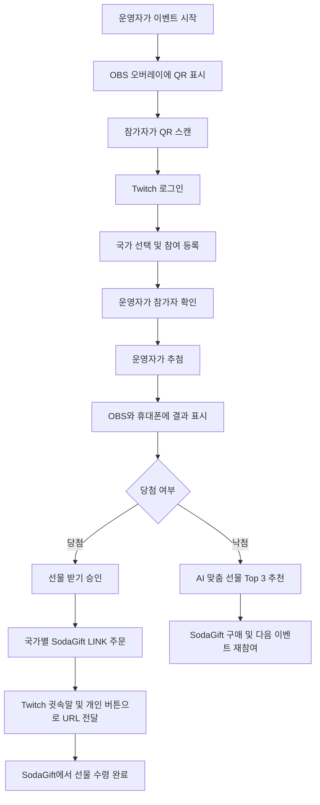
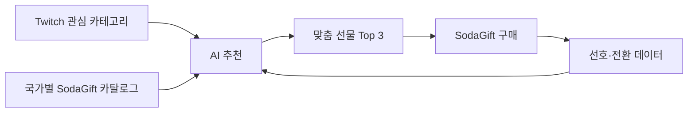
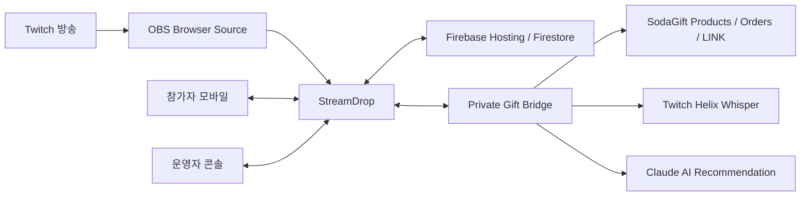

# StreamDrop

> Twitch 라이브 이벤트의 참여, 추첨, 글로벌 디지털 선물 수령을 하나의 실시간 경험으로 연결하는 팬 리워드 서비스

StreamDrop은 전 세계 시청자가 함께하는 라이브 방송에서 경품 이벤트를 쉽고 빠르게 운영하기 위한 해커톤 MVP입니다. 방송 화면에는 참여 QR과 당첨 결과가 표시되고, 시청자는 휴대폰에서 Twitch 계정으로 참여합니다. 당첨자가 직접 선물 수령을 승인하면 국가에 맞는 SodaGift LINK가 생성되며, Twitch 귓속말과 개인 수령 버튼을 통해 전달됩니다.

낙첨자에게도 경험이 끊기지 않습니다. Twitch 관심사와 국가별 SodaGift 카탈로그를 바탕으로 AI가 선물 Top 3를 추천해 이벤트 참여를 다음 구매와 재방문으로 연결합니다.

- 서비스: [hackathon-korean-team5.web.app](https://hackathon-korean-team5.web.app/)
- 참가자: [참여 화면](https://hackathon-korean-team5.web.app/join)
- 방송 화면: [OBS 오버레이](https://hackathon-korean-team5.web.app/overlay)
- 운영자: [운영자 콘솔](https://hackathon-korean-team5.web.app/admin?token=streamdrop)
- 발표 자료: [StreamDrop Twitch 해커톤 기획안 v4](Demo/Presentation/StreamDrop_Twitch_%ED%95%B4%EC%BB%A4%ED%86%A4_%EA%B8%B0%ED%9A%8D%EC%95%88_v4.pptx)

## 제품이 해결하는 문제

글로벌 라이브 방송의 추첨은 간단하지만, 당첨 이후의 선물 지급은 복잡합니다.

- 시청자의 국가마다 구매하고 사용할 수 있는 상품이 다릅니다.
- 실물 배송은 주소 수집, 배송비, 개인정보 처리 부담이 큽니다.
- 참여 확인, 추첨, 방송 연출, 경품 지급이 서로 다른 도구에서 진행됩니다.
- 공개 채팅에 수령 URL을 올리면 링크가 노출되거나 다른 사람이 사용할 수 있습니다.
- 낙첨자는 결과 발표 직후 이탈해 이벤트의 관심이 구매로 이어지기 어렵습니다.

StreamDrop은 OBS, 참가자 휴대폰, 운영자 콘솔, Firebase, SodaGift를 하나의 이벤트 상태로 연결합니다. 운영자는 방송 흐름을 멈추지 않고 추첨할 수 있고, 당첨자는 자신의 국가에서 사용할 수 있는 디지털 선물을 받을 수 있습니다.

## 제품 경험

### 이벤트 전체 흐름



### 참가자 경험

1. Twitch 방송 화면의 QR을 스캔합니다.
2. Twitch 계정으로 로그인하고 국가를 선택합니다.
3. 참여 완료 화면에서 추첨 결과를 기다립니다.
4. 당첨자는 **선물 받기** 버튼으로 주문 진행을 승인합니다.
5. StreamDrop이 국가에 맞는 SodaGift LINK를 발급합니다.
6. 참가자는 Twitch 귓속말 또는 자신의 휴대폰에 표시된 버튼으로 SodaGift 수령 페이지를 엽니다.
7. 낙첨자는 자신의 Twitch 관심사에 맞춘 선물 Top 3를 확인할 수 있습니다.

### 운영자 경험

1. 운영자 콘솔에서 이벤트를 시작합니다.
2. 참가자의 Twitch 표시 이름, 국가, 참여 인원을 실시간으로 확인합니다.
3. 당첨 인원을 설정하고 추첨 버튼을 누릅니다.
4. 당첨자, 주문 상태, LINK 발급 상태, Twitch 전송 상태를 확인합니다.
5. 이벤트를 초기화하고 다음 이벤트를 시작합니다.

### 방송 시청 경험

OBS Browser Source에 StreamDrop 오버레이를 추가하면 QR, 참여 인원, 추첨 결과가 Twitch 송출 화면에 실시간으로 반영됩니다. 시청자는 방송을 벗어나 별도의 복잡한 가입 절차를 거치지 않고 휴대폰으로 참여합니다.

## 핵심 기능

| 기능 | 제품 가치 |
|---|---|
| Twitch 계정 참여 | 중복·임의 닉네임 참여를 줄이고 방송 계정과 결과를 연결 |
| 국가 선택 | 참가자의 국가에서 사용할 수 있는 SodaGift 상품으로 지급 범위 제한 |
| OBS 실시간 오버레이 | QR 참여와 당첨 발표를 방송 콘텐츠의 일부로 연출 |
| 운영자 콘솔 | 이벤트 시작, 참가자 확인, 복수 인원 추첨, 지급 상태를 한 화면에서 관리 |
| 승인 기반 주문 | 추첨 시점이 아니라 당첨자가 **선물 받기**를 누른 뒤 주문 시작 |
| SodaGift LINK | 이메일·주소를 수집하지 않고 개인 수령 URL로 디지털 선물 전달 |
| 이중 전달 경로 | Twitch 귓속말을 우선 사용하고 휴대폰의 직접 수령 버튼을 보조 경로로 제공 |
| 낙첨자 AI 추천 | Twitch 관심사와 국가별 카탈로그를 분석해 Top 3 상품 추천 |
| 실시간 동기화 | Firebase Firestore를 통해 운영자, 오버레이, 참가자 화면의 상태 공유 |
| 데모 폴백 | 외부 AI 호출 실패 시 카탈로그 기반 추천으로 전환해 시연 흐름 유지 |

## SodaGift 연동

StreamDrop의 핵심은 당첨자의 명시적인 수령 의사 이후에만 주문을 시작한다는 점입니다.

```text
당첨 화면
  → 당첨자가 “선물 받기” 선택
  → 국가별 LINK 지원 상품 조회
  → SodaGift LINK 주문 생성
  → 주문 결과에서 개인 수령 URL 확인
  → Twitch 귓속말 + 참가자 전용 버튼으로 전달
  → SodaGift 수령 페이지에서 완료
```

사용하는 주요 API 흐름은 다음과 같습니다.

1. `GET /v1/products` — 국가와 `LINK` 전달 방식을 기준으로 사용 가능한 상품 조회
2. `POST /v1/orders` — 당첨자가 승인한 상품으로 LINK 주문 생성
3. `GET /v1/orders/{id}` — 주문을 조회해 `delivery.link` 획득
4. Twitch Helix Whisper — 로그인한 당첨자에게 수령 URL 전송

Twitch 귓속말은 플랫폼의 스팸·수신 설정에 따라 실제 도착이 제한될 수 있습니다. 따라서 전송 요청 결과를 운영자 콘솔에 표시하고, 당첨자 휴대폰에는 같은 URL을 여는 직접 수령 버튼을 제공합니다.

수령 URL은 링크를 가진 사람이 사용할 수 있는 민감 정보입니다. StreamDrop은 API 키를 공개 웹에 저장하지 않고, 수령 URL을 참가자 브라우저의 공개키로 암호화해 Firestore에 기록합니다. 평문 URL은 OBS에 표시하거나 주문 로그에 저장하지 않습니다.

## 낙첨자 AI 추천과 반복 구매

추첨 서비스는 보통 당첨자에게만 가치를 제공하고 종료됩니다. StreamDrop은 낙첨자의 관심을 다음 구매 기회로 바꿉니다.



- 입력: Twitch 팔로우 채널의 콘텐츠 카테고리, 참가 국가, SodaGift 상품 정보
- 추천: Claude Haiku 4.5가 카탈로그 안에서 적합한 상품 3개와 추천 이유 생성
- 폴백: AI 키가 없거나 호출·응답 파싱이 실패하면 카탈로그에서 3개 상품 추천
- 기대효과: 낙첨자의 이탈을 줄이고 후속 구매, 재참여, 반복 캠페인으로 연결

이 기능은 경품 주문뿐 아니라 낙첨자의 자발적 구매까지 SodaGift 거래로 전환할 수 있어, StreamDrop과 SodaGift가 함께 반복 매출을 만들 수 있는 확장 지점입니다.

## 시스템 구성



| 컴포넌트 | 역할 |
|---|---|
| StreamDrop | 참여, 추첨, 당첨 승인, 선물 수령, AI 추천을 연결하는 제품 로직과 UI |
| Firebase Hosting | 참가자·오버레이·운영자 화면의 공개 배포 |
| Firebase Firestore | `events/live` 이벤트 상태와 화면 간 실시간 동기화 |
| Private Gift Bridge | 비밀키를 보호하며 당첨 승인 감지, SodaGift 주문, 암호화, 귓속말 전송 수행 |
| SodaGift | 국가별 상품 카탈로그, LINK 주문, 최종 선물 수령 경험 제공 |
| Twitch | 참가자 인증, 방송 송출, 당첨자 개인 메시지 전달 |
| Claude | 낙첨자의 Twitch 취향과 카탈로그를 결합한 Top 3 추천 |

Firebase는 실시간 상태와 배포 인프라를 담당하며 SodaGift LINK를 직접 생성하지 않습니다. SodaGift 주문은 당첨자 승인 이후 StreamDrop의 비공개 지급 브리지가 생성합니다.

## 활용 분야

- K-CON·K-pop 팬미팅의 글로벌 팬 추첨
- 게임 출시 방송의 시청자 보상
- Twitch 크리에이터의 구독자 감사 이벤트
- 스포츠·e스포츠 라이브 경기 이벤트
- 브랜드 라이브 커머스와 스폰서 캠페인
- 온라인 컨퍼런스·커뮤니티 행사

## SodaGift와의 수익 시너지

StreamDrop은 단순 추첨 도구가 아니라 라이브 참여를 디지털 선물 구매로 연결하는 캠페인 채널입니다.

- 크리에이터·브랜드의 캠페인 운영료
- 당첨자 경품 주문에서 발생하는 SodaGift 거래 증가
- 낙첨자 AI 추천을 통한 추가 구매와 전환
- 반복 행사 계약과 브랜드별 운영 패키지
- 국가·카테고리·전환 데이터를 활용한 후속 캠페인 최적화

핵심 지표는 이벤트당 참여자 수, 경품 주문액, 수령 성공률, 평균 지급 시간, 추천 클릭률, 후속 구매 전환율, 반복 캠페인 비율입니다.

## 데모 시나리오

1. 운영자가 이벤트를 시작합니다.
2. OBS 오버레이에 참여 QR이 나타납니다.
3. 참가자가 QR을 스캔하고 Twitch 로그인 후 국가를 선택합니다.
4. 운영자 화면과 OBS의 참여 인원이 실시간으로 증가합니다.
5. 운영자가 추첨하면 OBS와 각 휴대폰에 결과가 표시됩니다.
6. 당첨자가 **선물 받기**를 누르면 SodaGift LINK 주문이 시작됩니다.
7. 당첨자는 Twitch 귓속말 또는 직접 수령 버튼으로 SodaGift 페이지를 엽니다.
8. 낙첨자는 AI가 추천한 선물 Top 3를 확인합니다.

## 로컬 실행

### 요구 환경

- Python 3.10 이상
- OBS Studio
- 실제 연동 시 Twitch Developer 앱, SodaGift Sandbox API 키
- AI 추천 실연동 시 Anthropic API 키

### 설치

```bash
git clone https://github.com/Changjae-LE/socal-k-group-hackathon.git
cd socal-k-group-hackathon/raffle-app

python3.12 -m venv .venv
source .venv/bin/activate
pip install -r requirements.txt
cp .env.example .env
```

### 실행

```bash
uvicorn app.main:app --host 0.0.0.0 --port 8000
```

공개 Firebase 이벤트에 실제 SodaGift LINK를 지급하려면 별도 터미널에서 지급 브리지를 실행합니다.

```bash
python scripts/fulfill_firestore_winners.py
```

로컬 화면은 다음 주소에서 확인할 수 있습니다.

| 화면 | 주소 |
|---|---|
| 참가자 | <http://127.0.0.1:8000/join> |
| OBS 오버레이 | <http://127.0.0.1:8000/overlay> |
| 운영자 | <http://127.0.0.1:8000/admin?token=streamdrop> |

### 주요 환경변수

실제 키는 `.env`에만 저장하고 Git에 커밋하지 마세요.

| 환경변수 | 용도 |
|---|---|
| `BASE_URL` | 로컬 서버와 Mock Claim URL의 기준 주소 |
| `PUBLIC_JOIN_URL` | QR과 Twitch OAuth가 돌아올 공개 참가 주소 |
| `ADMIN_TOKEN` | 운영자 화면 접근 토큰 |
| `TWITCH_CLIENT_ID` | Twitch OAuth 앱 ID |
| `TWITCH_BOT_USER_ID` | 귓속말 발신 계정 ID |
| `TWITCH_BOT_TOKEN` | `user:manage:whispers` 권한 토큰 |
| `SODAGIFT_API_KEY` | SodaGift Sandbox API 키 |
| `SODAGIFT_BASE_URL` | SodaGift API 기준 주소 |
| `ANTHROPIC_API_KEY` | 낙첨자 AI 추천 API 키 |
| `FIREBASE_PROJECT_ID` | 공개 이벤트를 저장하는 Firebase 프로젝트 |
| `FIRESTORE_EVENT_DOCUMENT` | 실시간 이벤트 문서 경로 |

Twitch Developer Console의 Redirect URL에는 아래 주소를 정확히 등록해야 합니다.

```text
https://hackathon-korean-team5.web.app/join
https://hackathon-korean-team5.web.app/join/callback
```

## 현재 MVP의 한계

- Twitch 귓속말은 플랫폼 정책과 수신자 설정에 따라 차단될 수 있습니다.
- Firestore는 해커톤용 단일 이벤트 문서를 사용합니다.
- 공개 데모용 Firestore 규칙은 운영 서비스 수준의 권한 모델로 교체해야 합니다.
- 주문 실패·환불·예산 제어·감사 로그는 운영 제품 전환 전에 강화해야 합니다.
- 다중 행사, 운영자별 권한, 다국어, 접근성, 분석 대시보드는 다음 단계입니다.

## 프로젝트 구조

```text
.
├── raffle-app/       # 최종 통합 데모: Firebase 화면, FastAPI 지급 브리지, SodaGift·Twitch·AI
├── streamdrop-app/   # 초기 Next.js + TypeScript OBS 오버레이 프로토타입
└── Demo/
    └── Presentation/ # 발표 자료
```

StreamDrop은 방송 화면의 QR을 글로벌 팬의 선물 수령과 다음 구매로 이어주는 것을 목표로 합니다.
